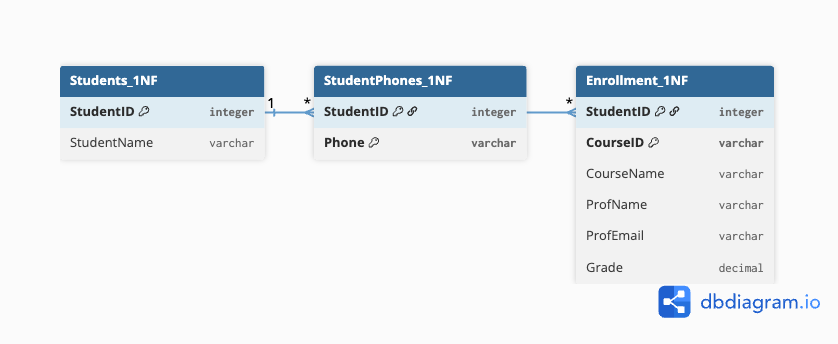
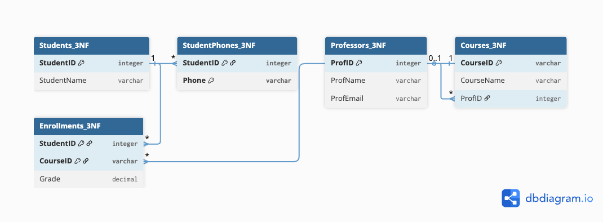

# Schema Normalization

The full schema in `sql/01_schema.sql` reaches BCNF and has 12 tables.
This document walks through the normalization process on a focused
slice of the schema (students, phones, courses, professors, grades)
to keep the explanation compact. The same pattern applies to the rest
of the schema.

The diagrams below were created with [dbdiagram.io](https://dbdiagram.io)
from DBML source.

---

## Step 0: UNF (Unnormalized Form)

A single flat table holds everything. Problems:

- **Phones are not atomic** — stored as a comma-separated list, violates 1NF.
- **Update anomaly** — changing a professor's email requires updating every
  enrollment row that references them.
- **Insert anomaly** — a new professor cannot be added without an
  enrollment.
- **Delete anomaly** — deleting all of a student's enrollments would also
  lose their phone numbers.
- **Redundancy** — student name, course name, professor data repeat on
  every row.

---

## Step 1: 1NF (atomic values)

Phones are extracted into their own table. Each cell now holds a single
atomic value. The composite primary key `(StudentID, Phone)` prevents
duplicate phone entries per student.

Remaining problems: course and professor data still repeat on every
enrollment row, because they only depend on `CourseID`, not on the full
key `(StudentID, CourseID)`.

---

## Step 2: 3NF (no partial or transitive dependencies)

I combine the 2NF and 3NF steps into a single refactoring, since both
eliminate dependencies on non-key attributes. Courses and Professors get
their own tables. Each non-key attribute now depends only on the primary
key of its table.

The Enrollments table now contains only what genuinely depends on the
combination of student and course: the grade.

---

## BCNF in the full schema

The slice above reaches 3NF. The full schema in `sql/01_schema.sql`
reaches BCNF.

The only non-trivial BCNF case in the full schema is in `CourseOfferings`.
The functional dependency `(ProfID, Semester) → CourseID` exists if each
professor teaches at most one course per semester. Strictly normalized,
this would require further decomposition. Instead, I enforce the
constraint with a `UNIQUE (ProfID, SemesterID, DayOfWeek, StartTime)`
index. This is a deliberate trade-off: further decomposition would break
a useful join dependency without adding meaningful protection beyond
what the unique constraint already gives.

---

## Relationship types in the final schema

- **1:1** — Department ↔ HeadProfessor (circular, nullable foreign key)
- **1:N** — Department → Students, Department → Professors,
  Professor → CourseOfferings, Room → CourseOfferings
- **M:N with attributes** — Students ↔ CourseOfferings via Enrollments
  (Grade, Status, EnrollDate live on the junction table)
- **M:N self-referential** — Courses ↔ Courses via Prerequisites
- **1:N from multivalued attribute** — Student → StudentPhones (extracted
  during 1NF normalization)
